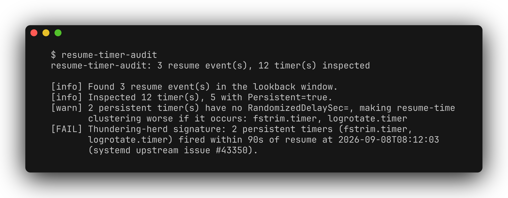

# resume-timer-audit

[](README.md) [](README.zh-CN.md)

只读的 Linux 诊断工具，用于排查系统从睡眠恢复后，多个 systemd timer 同时触发的情况。它把 journal 中的唤醒事件与 timer 最近一次触发时间关联起来，并提示没有随机延迟的持久化 timer。



这是排查唤醒后后台任务集中运行的工具，不是调度器，也不会自动修复。背景见 [systemd #43350](https://github.com/systemd/systemd/issues/43350)。

## 环境要求与安装

需要 Python 3.9+、使用 systemd 的 Linux，以及 PATH 中的 `journalctl` 和 `systemctl`。不适合在 macOS、Windows 或非 systemd Linux 上做主机诊断。Python 运行时仅依赖标准库。

```bash
git clone https://github.com/zhuhroscar-tech/resume-timer-audit.git
cd resume-timer-audit
python3 -m venv .venv
source .venv/bin/activate
pip install -e .
resume-timer-audit --help
```

也可使用 [GitHub Releases](https://github.com/zhuhroscar-tech/resume-timer-audit/releases) 中的独立 `.pyz`，执行前先用同一 release 的 `SHA256SUMS.txt` 校验。

## 运行审计

```bash
resume-timer-audit
resume-timer-audit --json
resume-timer-audit --lookback-days 30
```

默认回溯 14 天 journal。若至少两个持久化 timer 的最近一次触发落在同一次唤醒后的 90 秒内，就判为集中触发。退出码：`0` 仅有信息提示，`1` 有警告，`2` 检测到集中触发。

读取系统 journal 可能需要加入 `systemd-journal` 组或使用较高权限。无法读取 journal 或枚举 timer 时会给出警告，不会当作已确认正常。

## 限制与安全

- 仅读取日志和 unit 元数据，不修改 timer、不启动服务、不调整计划、不写入自身状态文件；无网络请求或遥测。
- 使用的是每个 timer 的**最近一次触发时间**，并非完整触发历史。延长回溯范围无法恢复已被后续触发覆盖的元数据。
- 时间解析采用尽力匹配方式，journal 简短时间戳按当前年份处理；语言环境、时区及跨年都可能影响结果。
- 集中触发说明时间上有关联，不等于证明 CPU/IO 争用或其原因。手动调整随机延迟或日历计划前，应先检查相关 unit 和实际负载。

## 开发

```bash
pip install -e ".[dev]"
pytest -v
```

[测试目录](tests)覆盖解析、集中触发判断、子进程失败及 CLI 行为。[MIT 许可证](LICENSE)。
